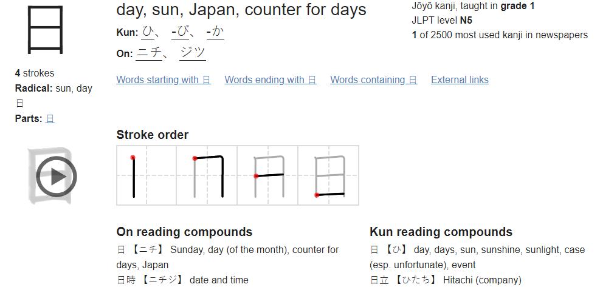

# Overview and Data
As can be inferred from my other projects, I am interested in Japanese media. This interest has inspired me to try and learn a bit of Japanese. One of the most difficult parts is learning the necesary Kanji to understand a written sentence. Many say that to be fluent, one must know about 2000 Kanji. To start my learning journey, I went for the old fashioned flashcard method to memorize the characters.

The data I started with was a list of ~2500 kanji characters ordered by their popularity in newspaper usage. Below is a small snippet of the beginning of the list.
```
1: 日
2: 一
3: 国
4: 会
5: 人
6: 年
7: 大
```
Information about the character meanings and different pronunciations were gathered off the web by web scraping and structured in a way to easily create all of the flashcards at once using Quizlet.

# Tools used
I scraped the data and organized it using Python 3.6.5. The libraries used were BeautifulSoup, re, and requests. After scraping the data, a dictionary was made and this resulting file was saved as a pickle file. Therefore, pickle was used to reload the dictionary object back into Python if for some reason it was needed again.

# The Process
A dictionary entry for each kanji in the list was searched for using jisho.org.

The definition and kun and on readings at the top of the image were stored along with the different usage cases for the different type of readings(shown at the bottom of the image). The information for the kanji was printed out in the following format:
```
日~1. day, sun, Japan, counter for days
Kun readings: ['ひ', '-び', '-か']
ひ:  日 day, days, sun, sunshine, sunlight, case (esp. unfortunate), event
On readings: ['ニチ', 'ジツ']
ニチ:  日 Sunday, day (of the month), counter for days, Japan
ジツ:  日月 sun and moon, time, days and months, years, Sunday and Monday
|
一~2. one, one radical (no.1)
Kun readings: ['ひと-', 'ひと.つ']
On readings: ['イチ', 'イツ']
イチ:  一 one, best, first, foremost, beginning, start, ace (playing card), bottom string (on a shamisen, etc.)
イツ:  均一 uniformity, equality
```
where the print would continue for however many characters the user wants. This can be copy and pasted into the quizlet flashcard maker where the "~" can be used to separate character from information and th "|" can be used to separate the different flashcards.

# Replicating the results
One can simply run kanji_flashcards.py which will load the scraped data from the pickle file and print the formatted data. top_kanji.py will scrape the information off of jisho.org.

# Author
Dexter Luu
